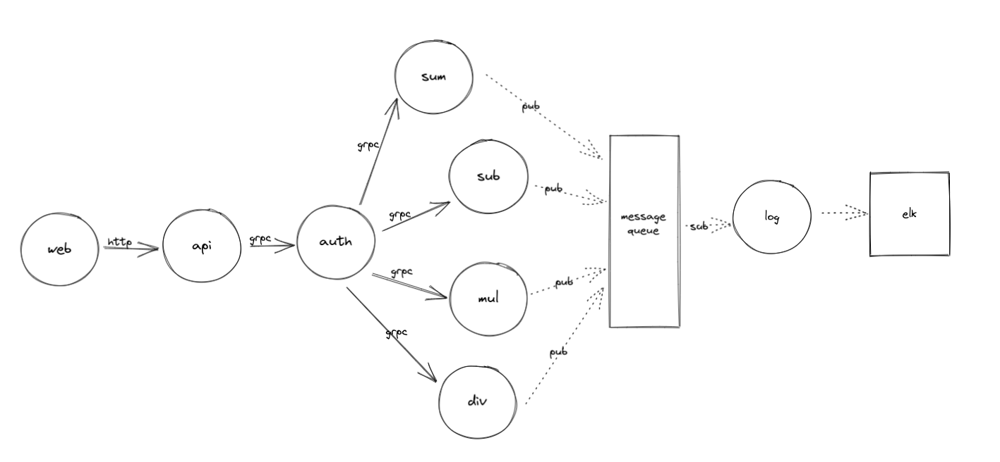

# What

An example of how microservices interact with each other using grpc using CQRS pattern.

# Why

I found a lot of examples of single service implementing grpc or internal functions calling grpc of each other but not many examples. (Here's one **[example](https://github.com/jfeng45/servicetmpl1)**, but it seems not to be very beginner-friendly so I make my own).

# Usage

# Dev note

Architecture overview

wherein:

* `sum, sub, mul, div` are the coolest services on the planet 😛
* folks that don't login as admin can only use trial feature: calculate numbers less than 10, folks login as `admin (password admin)` can do operations with numbers up to 1000 😃
